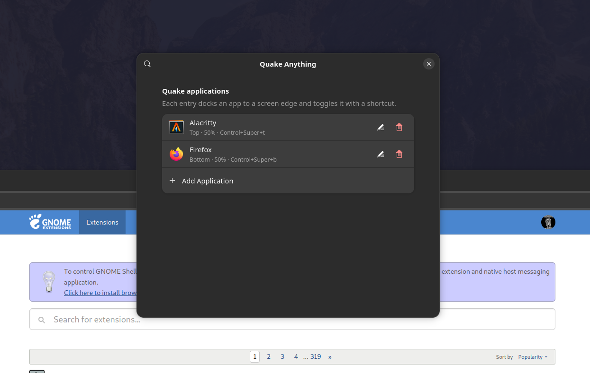

# Quake Anything

Drop down (or side-dock) **any** GUI app with a keyboard shortcut — Quake-style, not just a terminal.

[](https://extensions.gnome.org/extension/10596/quake-anything/)
[](https://release.gnome.org/)
[](LICENSE)

<p align="center">
  
</p>

Assign a shortcut to any installed application and it drops in from the edge you
picked. Press again to hide it. There is no panel icon — everything lives in the
extension's settings.

## Install

### From extensions.gnome.org (recommended)

Install directly from the [extension page](https://extensions.gnome.org/extension/10596/quake-anything/),
or search for **Quake Anything** in **Extension Manager**.

### From a release

Download `quake-anything@yccoskun.github.io.shell-extension.zip` from the
[latest release](https://github.com/yccoskun/quake-anything/releases/latest) and install it:

```bash
gnome-extensions install --force quake-anything@yccoskun.github.io.shell-extension.zip
gnome-extensions enable quake-anything@yccoskun.github.io
```

### From source

```bash
git clone https://github.com/yccoskun/quake-anything.git
cd quake-anything
bun install
bun run install-ext
gnome-extensions enable quake-anything@yccoskun.github.io
```

On Wayland, log out and back in after installing.

## Setup

Open **Extension Manager** (or **Extensions**) → Quake Anything → **Settings**,
add an entry, and set:

| Setting | Meaning |
|--------|---------|
| **Application** | Any installed GUI app |
| **Side** | Top / bottom / left / right |
| **Monitor** | Automatic, or a specific connected monitor |
| **Keyboard shortcut** | Toggle show/hide (Esc cancels, Backspace clears; conflicts are warned) |
| **Default size** | Percentage of the monitor work area (10–90%) |
| **Top crop** | Pixels hidden from the top of the window; useful for client-side PWA/browser chrome (`0` disables) |

Press the shortcut to spawn. Press again to hide. Press again to show at the
Quake edge and size.

## Features

- Dock any installed GUI app to **top**, **bottom**, **left**, or **right**
- Multiple apps, each with its own shortcut, monitor, size, and optional top crop
- Default size as a **percentage** of the monitor work area, so cross-monitor
  moves keep the ratio rather than a fixed pixel size
- First spawn appears on the monitor under the mouse pointer; later toggles
  restore the docked layout
- While visible you can move, resize, minimize, or maximize freely — the next
  shortcut press snaps back to the Quake position
- Only windows **spawned by this extension** are controlled; other windows of
  the same app are left alone
- Windows survive suspend and resume in place

## Notes

- On Wayland, reloading GNOME Shell requires logging out and back in. You can
  often reload just this extension with disable → enable.
- Client-side window chrome cannot be removed by GNOME reliably. **Top crop**
  hides it visually for Quake windows while keeping the application itself
  unchanged.
- Some single-instance apps may not open a second window when one is already
  running.

## Development

Requires [Bun](https://bun.sh/) (or Node) and TypeScript. Source under `src/` is
compiled with `tsc` into separate modules under `dist/` — not bundled into one
file, which the extensions.gnome.org review process requires.

```bash
bun install
bun run build          # tsc → dist/*.js (+ dist/prefs/)
bun run schemas        # compile GSettings schemas
bun run lint           # build, then eslint the emitted JS
bun run pack           # stage the modular tree and pack the zip
bun run install-ext    # stage and install into ~/.local/share/...
```

Packed runtime layout:

- `extension.js`, `prefs.js` (entry points)
- `types.js`, `geometry.js`, `keybindings.js`, `quake-manager.js`
- `prefs/conflicts.js`, `prefs/shortcut-dialog.js`
- `metadata.json`, `LICENSE`, `schemas/`

### Releasing

1. Update `version-name` in `metadata.json` and `version` in `package.json` to
   the same value.
2. Add the release section to [CHANGELOG.md](CHANGELOG.md).
3. `bun run pack` to produce the zip.
4. Tag (`git tag -a v1.0.2 -m 'v1.0.2'`) and push.
5. Create the GitHub release with the changelog section as the body and the zip
   attached, then upload the same zip to extensions.gnome.org.

The zip is generated, not committed — it is attached to releases only.

## Changelog

See [CHANGELOG.md](CHANGELOG.md).

## License

[GPL-2.0-or-later](LICENSE) © 2026 Quake Anything contributors

**UUID:** `quake-anything@yccoskun.github.io`
